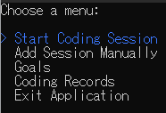
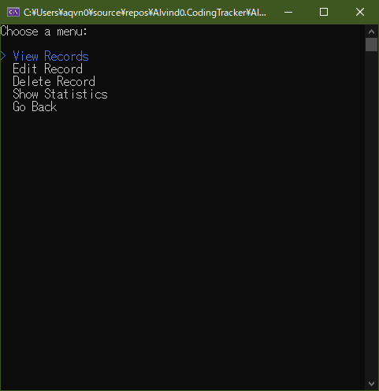
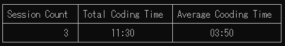
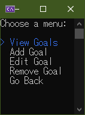
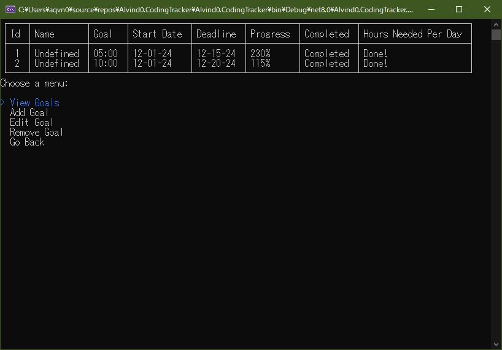

# Coding Tracker
This is a CRUD applications that logs the user's daily coding time. 
This is a project for [The C# Academy](https://thecsharpacademy.com/project/13/coding-tracker).
Developed using *C#*, *SQLite*, *Dapper ORM*.

## Requirements 
- [x] Create a configuration files for database path and connection strings
- [x] Ability to log daily coding time.
- [x] Use *Spectre.Console* to show data
- [x] Have separate classes in different files
- [x] Create a `CodingSession` class which contains properties `Id`, `StartTime`, `EndTime`, `Duration`
- [x] Session duration should be calculated automatically with `CalculateDuration` ??

	 I didn't have to do this because my class automatically calculates it.
- [x] Ability to input start and  end times manually
- [x] Use *Dapper ORM*
- [x] Read tables into a list of *Coding Sessions*
- [x] Track coding time via a stopwatch(real-time)
- [x] Ability to filter records per period(weeks, days, years)
- [x] Ability to sort by ascending or descending
- [x] Ability to set goals and show progress towards that goal(C# or SQL queries)

## Features
-
* Track your coding time
	- Uses an SQLite connection to store coding sessions, and goals
	- Automatically calculates session duration and goal progress

-
* Stopwatch - Track coding time in real time.

* Manual Logging - Add sessions manually.

-
-

* Session Management
	- View, edit, or delete session records.
	- Get insights of your coding habits with session count, total coding time, and average session duration.

-
-
* Goal Settings 
	- Set coding duration goals
	- The program calculates how much time you need to code per day to achieve your goals
	
## Lessons Learned
- Separating a project into multiple files was a challenge, but it helped make me code cleaner and easier to maintain.
- Creating the back-end (database, logic) before anything else will help in shortening development time. I build the menu and controllers first then had to rewrite a fourth of it because they were not neccessary and did belong in the data layer.
- As the scope gets bigger, the harder it gets to just "wing it", and this app's scope isn't even big. Having at least something that resembles a design in mind goes a long way.
- Having built the habit logger project. I had some experience with SQLite. I didn't have the confidence when I started building this project but it was easier than I expected. **It doesn't matter how small it is, experience is experience.**

## Challenges
- SQLite doesn't support DateTime and TimeSpan, so I had to be creative with how I parse them and I don't want to talk about how long it took me to figure it out. I don't want to use SQLite again.
- I only intended to make it as required, but scope creep got to me. I have to abandon a few ideas because this project was taking way too long. Examples of ideas are as follows: Having a front-end, Adding the ability to pause the stopwatch (when duration of sessions neededed to be automatically calculated)
- Code Maintainability. I had a lot of trouble thinking of what class to make, what methods to put in that class, etc. and I don't even think I've done a good enough job. Good thing this is a one-off project. This will be something I have to work at right now. 
- Separating the application into multple classes meant I had to change screen very often to read how a method works.
- I hope I could learn how to test my app in the near future. I used the app for a few days but I'm still worried about edge cases.
- ~~I couldn't understand asynchronous operations and just threw in async and await and brute force tested my way into finishing the app. Yes, I just threw in code and hope it works and it did! Good job, me!~~

## Things I noticed after trying to give a "self-review", reading through my code line by line (Points of Reflection)
Mostly about scope and SoC to be honest.

1. I didn't bother thinking of access modifiers, and forgot that directly accessing a data class from another data class is bad.
The reason for this is: direct access between data classed creates tight coupling. Which means changes in a class may impact the other.
If done intentionally, it's fine. But not in my case. It voilates SoC principles. I should have had the controller mediate interactions between them.
  
2. Encapsulation. I had methods that had the same name between classes. All my classes were public or internal, so if I wasn't careful I could have called a method from another class unintentionally.
I was successful in hiding internal implementation details but failed on restricting access to only expose necessary methods. TLDR: I didn't think things through.
